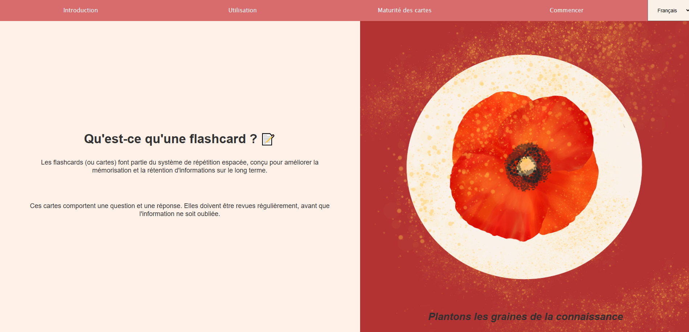
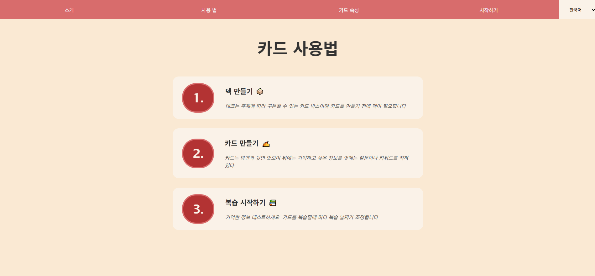
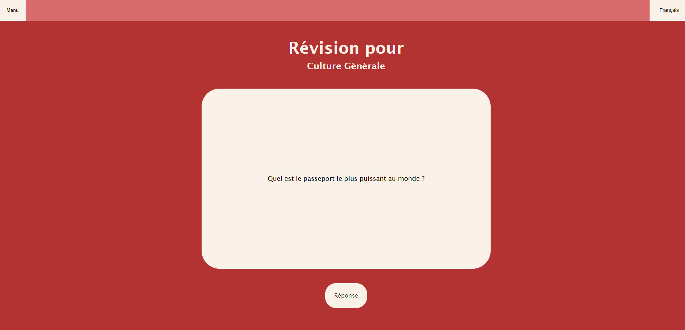

# Présentation

Cette application web est basée sur une version simplifiée du concept de révision espacée, qui consiste à revoir des informations avant un certain laps de temps afin d'améliorer la mémorisation, et ainsi assimiler des connaissances sur le long terme. 
L'application est disponible dans les langues suivantes : Français, anglais, coréen.
En l'état actuel, l'application n'est adaptée que pour les écrans d'une taille standard de 1920×1080 minimum.
Le design de la page d'accueil doit être revu pour le déploiement d'une version mobile. 

## Fonctionnalités : 

- Création d'un paquet :
L'utilisateur peut créer un paquet qui contient les flashcards du thème qui lui est donné. 
L'utilisateur peut définir une limite journalière au nombre de nouvelles cartes auquel il est exposé.

- Créer des cartes :
 L'utilisateur peut créer des flashcards.

- Processus de révision : 
Les paquets de révision sont construits chaque jour automatiquement, en fonction des dates de révision des cartes. 
Chaque carte a une date unique, qui est calculée et actualisée en fonction des performances de l'utilisateur lors de la révision.

- Prévision des révisions : 
L'utilisateur peut voir le nombre de cartes à revoir pour chaque jour de la semaine,
afin de pouvoir estimer sa charge de travail.

## Lancement et installation :   
1. Lancement du serveur : 

    Exécuter le fichier server.py (serveur python local)

    Accéder à l'application via http://localhost:8000/
2. Installer et lancer Cypress :

    npx cypress install

    npx cypress open

## Utilisation :   
Cliquer sur le bouton "Commencer" sur la page d'accueil.  
Dans le menu principal, créer un paquet, créer des cartes, et cliquer sur le titre du paquet pour commencer le processus de révision.

Lors de la révision :
- Une bonne réponse attribue une nouvelle date de révision à la carte
- Une mauvaise réponse conserve la carte dans le paquet à revoir

Raccourcis clavier (révision):   
- Espace : afficher la réponse
- Flèche droite : bonne réponse
- Flèche gauche : mauvaise réponse

## Test : 

Tous les rapports de bug ont été rédigés après que l'application web ait atteint un stade de développement satisfaisant, 
c'est-à-dire après l'implémentation de toutes les fonctionnalités clés (Sauvegardes, révision, lancement du serveur, traduction, prévision des révisions).

Des automatisation de tests ont été réalisés avec l'outil Cypress pour confirmer le bon comportement de l'application, et pour répondre au cas de tests rédigés dans le dossier QA.

Outils conçu pour les test (non présent dans la version finale)  : 
- Augmentation de la date de révision dans debug-tools.js pour tester les révisions.
L'augmentation de la date de révision artificiellement provoque des erreurs dans la prévision des révision, car celle-ci est basée sur la date du système. 
- Suppression des données
- Création d'un deck par défaut pour faciliter les tests

## Dépendances : 
- HTML5
- CSS3
- Vanilla JavaScript (ES6)
- Navigateur localStorage
- Python
- Cypress

## Bibliothèques indépendantes : 
- AOS (Animate on scroll), utilisée pour l'UI dans index.html
- Plotly

## Screenshots

Page d'accueil français - coréen

  

Menu

Révision

## Assets et crédits : 
- Toutes les icônes utilisées sont libres de droit (Icons8)
- Les illustrations sont créées par l'auteur

## Auteur

Développé par Anaïs KEDZIA  
anais.kedzia@gmail.com  
[LinkedIn](https://www.linkedin.com/in/anais-kedzia/  )  
[GitHub](https://github.com/AnaisKedzia )   
